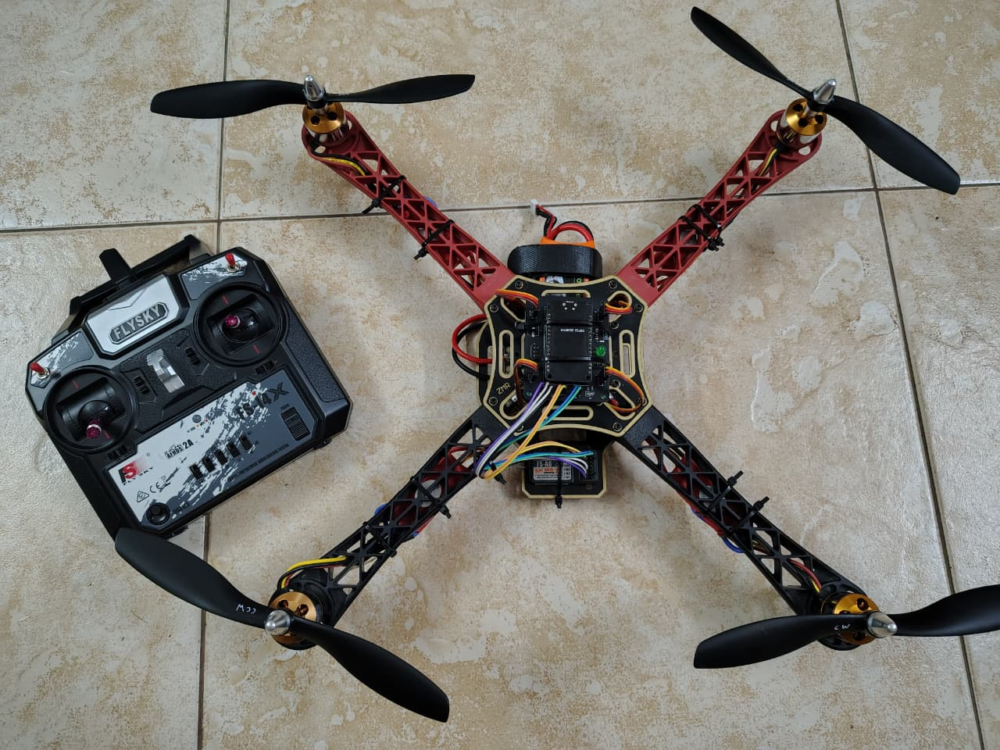

# ESP32-Quadcopter-FlightController

Open-source ESP32-based flight controller for quadcopters, implementing sensor fusion, nested PID control, motor mixing, and real-time Wi-Fi tuning. Designed with a custom PCB supporting altitude hold, GPS, and FPV modules.

---

## 📘 Introduction
This project is a fully custom **ESP32-based quadcopter flight controller**, built from scratch to provide complete hardware and firmware flexibility.  
Unlike commercial closed-source flight controllers, this system allows direct modification of IMU handling, PID algorithms, motor mixing, and communication layers—making it ideal for learning, research, and UAV experimentation.

The controller runs an **83 Hz control loop**, uses a **complementary filter** for real-time roll/pitch estimation, and stabilizes the quadcopter using **nested PID loops** (Angle + Rate).  
A built-in **Wi-Fi interface** enables on-the-fly PID tuning and telemetry, eliminating the need to reflash firmware between adjustments.

This project includes the firmware, PCB design files, and a complete engineering report documenting every part of the system.

---

## ⭐ Highlights
- Custom ESP32-based flight controller firmware  
- Complementary filter for attitude estimation  
- Dual-loop PID control for roll, pitch, and yaw  
- Motor mixing for X-configuration quadcopters  
- Real-time Wi-Fi tuning dashboard  
- Custom two-layer PCB with expansion support  
- Stable and tested flight performance (90–95%)  
- Open-source and fully modifiable

---

## 🖼 Drone Image

---

## 🔧 Features
- Real-time IMU data acquisition using MPU6050  
- Complementary filter–based angle estimation  
- Nested PID loops for angle and rate stabilization  
- PWM signal generation for ESCs  
- i-BUS / PWM receiver input handling  
- Wi-Fi HTTP server for dashboard + tuning  
- Support for barometer (alt-hold), GPS, and FPV modules  
- Modular code structure for easy experimentation

---

## 🛠 Hardware Used
- ESP32 Dev Module  
- MPU6050 IMU  
- A2212 1400KV motors + 30A ESCs  
- FlySky FS-i4X receiver  
- 3S Li-Po battery  
- F450 frame  
- Custom-designed flight controller PCB

---

## 📂 Repository Contents
- `Code/` – Flight controller firmware  
- `PCB/` – KiCad schematic + PCB layout  
- `Media/` – Drone Flight Media
- `Project Report.pdf` – Full technical report  

---

## 🚀 Getting Started
1. Flash the ESP32 with the firmware in `src/`  
2. Connect the MPU6050 via I²C and hook ESC signals to PWM pins  
3. Power the system with a 3S Li-Po battery  
4. Connect to the Wi-Fi access point  
5. Open the tuning dashboard and configure PID gains  
6. Perform pre-flight calibration and test hover at low throttle
