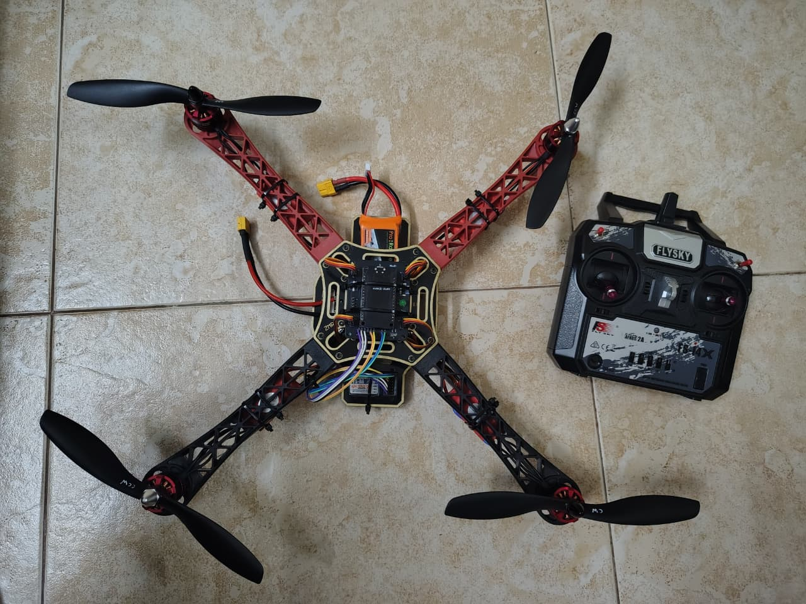

# ESP32-Quadcopter-FlightController

Open-source ESP32-based flight controller for quadcopters, featuring sensor fusion, nested PID control, motor mixing, real-time Wi-Fi PID tuning, and a custom KiCad PCB with support for GPS and FPV modules.

---

## 📘 Introduction
This project is a fully custom **ESP32-based quadcopter flight controller**, built from scratch to provide complete hardware and firmware flexibility.  
Unlike commercial closed-source flight controllers, this system allows direct modification of IMU handling, PID algorithms, motor mixing, and communication layers—making it ideal for learning, research, and UAV experimentation.

The controller runs an **83 Hz control loop**, uses a **complementary filter** for real-time roll/pitch estimation, and stabilizes the quadcopter using **nested PID loops** (Angle + Rate).  
A built-in **Wi-Fi interface** enables on-the-fly PID tuning and telemetry, eliminating the need to reflash firmware between adjustments.

This repository includes the complete firmware, custom KiCad PCB design, calibration and testing utilities, project media, and a comprehensive technical report documenting the system design and implementation.

---

## ⭐ Highlights
- Custom ESP32-based flight controller firmware  
- Complementary filter for attitude estimation  
- Dual-loop PID control for roll, pitch, and yaw  
- Motor mixing for X-configuration quadcopters  
- Real-time Wi-Fi tuning dashboard  
- Custom two-layer PCB with expansion support  
- Stable and tested flight performance (90–95%)  
- Open-source and fully modifiable

---

## 🖼 Drone Image

---

## 🔧 Features
- Real-time IMU data acquisition using MPU6050  
- Complementary filter–based angle estimation  
- Nested PID loops for angle and rate stabilization  
- PWM signal generation for ESCs  
- i-BUS / PWM receiver input handling  
- Wi-Fi HTTP server for dashboard + tuning  
- Support for barometer (alt-hold), GPS, and FPV modules  
- Modular code structure for easy experimentation

---

## 🛠 Hardware Used
- ESP32 DevKit V1
- MPU6050 IMU  
- RS-2212 920KV motors + 30A ESCs  
- FlySky FS-i4X receiver  
- 3S Li-Po battery  
- F450 frame  
- Custom-designed flight controller PCB

---

## 📂 Repository Contents

- `Firmware/`
  - `Main_Firmware/` – Main ESP32-based quadcopter flight controller firmware
  - `Testing_Calibration/` – Calibration, testing, and Wi-Fi PID tuning utilities
  
- `Hardware/`
  - `Drone Flight Controller/` – Complete KiCad project (schematic, PCB layout, and project files)
  - `FC Gerber.zip` – PCB manufacturing (Gerber) files
  - `PCB View.pdf` – PCB layout overview
  - `Schematic.pdf` – Flight controller circuit schematic
  
- `Media/`
  - `Drone/` – Drone assembly, flight controller, and hardware images
  - `Test Flight and Calibration/` – Flight test videos, calibration recordings, and PID response graph

- `Technical Report.pdf` – Comprehensive technical documentation covering hardware design, firmware architecture, implementation, and testing

---

## 💻 Software Requirements

- Arduino IDE 2.x
- ESP32 Arduino Core
- KiCad 9.x (for PCB design)

---

## 📚 Libraries Used

- `Wire` – I²C communication
- `ESP32Servo` – ESC PWM control
- `WiFi` – Wireless communication
- `AsyncTCP` – Asynchronous TCP networking
- `ESPAsyncWebServer` – Web-based PID tuning dashboard
- `SPIFFS` – Web dashboard file storage

---

## 🚀 Getting Started

Follow the steps below to configure and fly the quadcopter for the first time.

### 1. Hardware Setup
- Assemble the quadcopter and connect all hardware components.
- Wire the ESP32, MPU6050, ESCs, receiver, and motors according to the provided schematic.

### 2. Verify Receiver and ESCs
- Upload the firmware from `Firmware/Testing_Calibration/Receiver_PWM_Testing/` to verify proper receiver operation.
- Upload the firmware from `Firmware/Testing_Calibration/ESC_Calibration/` and calibrate all ESCs.

### 3. Calibrate the IMU
- Upload the firmware from `Firmware/Testing_Calibration/IMU_Calibration/`.
- Place the quadcopter on a level surface and perform the IMU calibration.
- Copy the generated accelerometer and gyroscope offset values into both the main flight controller firmware and the PID tuning firmware.

### 4. Tune the PID Controller
- Upload the firmware from `Firmware/Testing_Calibration/PID_Tuning_Webserver/`.
- Connect to the ESP32 Wi-Fi access point and open the PID tuning dashboard.
- Tune the roll, pitch, and yaw PID gains until stable flight performance is achieved.
- Copy the optimized PID values into the main flight controller firmware.

### 5. Upload the Main Flight Controller Firmware
- Open `Firmware/Main_Firmware/Flight_Controller_v2/Flight_Controller_v2.ino`.
- Update the firmware with the calibrated IMU offsets and tuned PID gains.
- Upload the firmware to the ESP32.

### 6. Perform Flight Testing
- Verify the motor rotation direction and propeller orientation.
- Perform an initial low-throttle hover test in a safe, open area.
- Fine-tune the PID gains as required to achieve stable and responsive flight.
